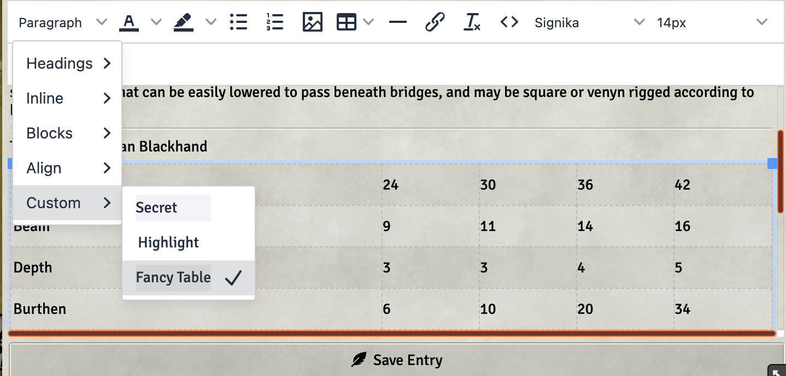

# Hârn Journal Styling

## Usage
1. After you install this module, you will have a "Hârnic" inspired formatting to your
   journal entries. This is mostly based on [D&D 5th Edition PHB Journal Styling for Foundry VTT](https://github.com/Daxiongmao87/foundry-vtt-5e-phb-journal-styling), but with some minor tweaks.
2. Additionally, when editing, there are several changes to the editor:
   3. There is now a font selector drop-down as well as a font size selector. The default
      fonts remain, including the Hârn fonts but the styled fonts are listed at the bottom. 
      
   4. Font and Background color selection tools are now available
   5. If you are editing a table, you can get a fancy border around the table under the
      style selector. 
      

## Installation
Use this [manifest file](https://github.com/scooper4711/foundry-vtt-harn-styling/blob/main/module.json)
## Credits
* This module is based heavily on Daxiongmao87's D&D 5th Edition PHB Journal Styling for Foundry VTT. 
* Most of the fonts used in this CSS are from https://github.com/jonathonf/solbera-dnd-fonts
